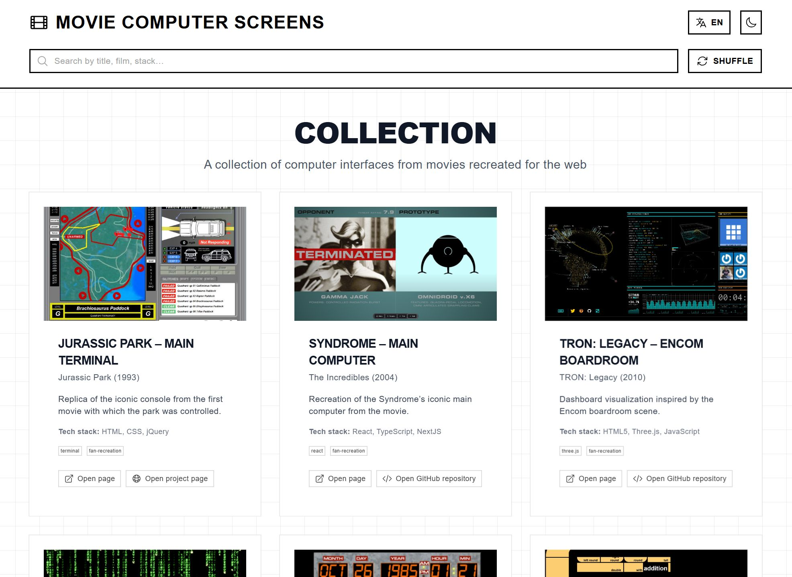

# Movie Computer Screens Collection

A curated collection of computer interfaces from movies recreated for the web. Built with Nuxt 4, featuring GSAP animations and Swiss Style design principles. Explore iconic movie computer screens, from futuristic HUDs to retro terminals, all faithfully recreated as interactive web experiences.



**🌐 Live Demo:** [https://projects.manuelhintermayr.com/movie-os-collection](https://projects.manuelhintermayr.com/movie-os-collection)

**Developed by:** [Manuel Hintermayr](https://github.com/manuelhintermayr)  
**Repository:** [https://github.com/manuelhintermayr/movie-os-collection](https://github.com/manuelhintermayr/movie-os-collection)

## 🎬 About

This project showcases computer interfaces and operating systems featured in movies, recreated as interactive web experiences. From the sleek interfaces of *Minority Report* to the retro terminals of *WarGames*, discover how filmmakers envisioned technology and bring these iconic screens to life in your browser.

## 🚀 Features

- 🎬 **Movie OS Collection** - Curated selection of computer interfaces from films
- ⚡️ **Nuxt 4** - Latest version with improved performance and new features
- 🎨 **Swiss Style Design** - Clean, grid-based layout with typography focus
- 🎭 **GSAP Animations** - Smooth entrance animations and interactive effects
- 🐭 **Mouse Follower** - Dynamic cursor effects with custom states
- 🌍 **Internationalization** - Full i18n support (English/German)
- 🌙 **Dark Mode** - Built-in dark/light mode toggle
- 📱 **Responsive Design** - Mobile-first approach
- � **Search & Filter** - Find projects by title, film, or technology stack
- � **Shuffle Feature** - Randomize project display
- � **TypeScript** - Full TypeScript support with type safety


## 🛠️ Technology Stack

### Core Frameworks
- **[Nuxt 4](https://nuxt.com/)** - The Intuitive Vue Framework
- **[Vue 3](https://vuejs.org/)** - Progressive JavaScript Framework

### UI & Styling
- **[Nuxt UI](https://ui.nuxt.com/)** - Fully styled and customizable components
- **[Tailwind CSS](https://tailwindcss.com/)** - Utility-first CSS framework
- **Swiss Style Principles** - Grid-based layouts, clarity, and typographic hierarchy

### Animation & Effects
- **[GSAP](https://greensock.com/gsap/)** - Professional-grade animation library
- **[ScrollTrigger](https://greensock.com/scrolltrigger/)** - Scroll-based animation trigger
- **[Mouse Follower](https://github.com/Cuberto/mouse-follower)** - Dynamic cursor effects

### Data & Internationalization
- **[@nuxtjs/i18n](https://i18n.nuxtjs.org/)** - Internationalization module
- **JSON Data Structure** - Centralized project data management
- **Support for:** English (en) and German (de)
- **Lazy loading** - Translation files loaded on demand

### Icons & Assets
- **[@iconify-json/heroicons](https://iconify.design/)** - Heroicons icon collection
- **[@nuxt/icon](https://github.com/nuxt/icon)** - Icon component with 200k+ icons

### Development Tools
- **TypeScript** - Full type safety and IntelliSense
- **VS Code Integration** - Automatic code cleanup and unused import removal
- **Utility Scripts** - i18n management and code quality checks

## 📦 Installation

```bash
# Clone the repository
git clone https://github.com/manuelhintermayr/nuxt4-template-swiss-style.git
cd nuxt4-template-swiss-style

# Install dependencies
npm install
# or
pnpm install
# or
yarn install
# or
bun install
```

## 🎮 Collection Highlights

### Featured Movie Interfaces
- **Iron Man (2008)** - Tony Stark's Holographic Interface
- **Minority Report (2002)** - PreCrime System Interface  
- **The Matrix (1999)** - Digital Rain Terminal
- **WarGames (1983)** - WOPR Military Computer
- **Alien (1979)** - Nostromo Ship Computer
- **Blade Runner (1982)** - Voight-Kampff Test Interface
- **And many more...**

### Project Data Structure
Each movie computer interface includes:
- **Title** - Interface name
- **Film** - Source movie
- **Description** - Detailed background (English/German)
- **Tech Stack** - Technologies used in recreation
- **Live Demo** - Interactive web version
- **Source Code** - GitHub repository link
- **Screenshots** - Visual previews

## 🚦 Development

Start the development server on `http://localhost:3000`:

```bash
npm run dev
# or
pnpm dev
# or
yarn dev
# or
bun run dev
```

### Additional Development Commands

```bash
# Code Quality Checks
npm run check:unused-vars          # Check for unused variables
npm run check:unused-vars-enhanced # Enhanced unused variable analysis
npm run lint:check                 # Run all code quality checks

# i18n Management  
npm run analyze:i18n              # Analyze i18n string usage
npm run cleanup:i18n              # Remove unused i18n strings

# Production Build
npm run build                     # Build for production
npm run preview                   # Preview production build
```

## 🏗️ Project Structure

```
movie-os-collection/
├── app/
│   ├── app.config.ts           # App configuration
│   ├── app.vue                 # Root application component
│   ├── assets/
│   │   ├── css/               # Global styles and CSS files
│   │   └── data/              # Project data and type definitions
│   │       ├── projects.json   # Movie interface collection data
│   │       └── types.ts        # TypeScript interfaces
│   ├── components/             # Reusable Vue components
│   │   ├── MovieCollectionHeader.vue # Header with search and controls
│   │   ├── MovieCollectionHero.vue   # Hero section
│   │   ├── ProjectCard.vue            # Individual project card
│   │   ├── ProjectGrid.vue            # Grid layout for projects
│   │   ├── LanguageSwitcher.vue       # Language toggle component
│   │   └── LoadingScreen.vue          # Loading animation
│   ├── layouts/
│   │   └── default.vue         # Default layout template
│   ├── pages/
│   │   └── index.vue           # Main collection page
│   └── plugins/
│       └── mouse-follower.client.ts # Mouse cursor effects
├── i18n/
│   ├── i18n.config.ts         # i18n configuration
│   └── locales/               # Translation files
│       ├── en.json            # English translations
│       └── de.json            # German translations
├── scripts/                   # Utility scripts for development
├── public/                    # Static assets and media
├── nuxt.config.ts            # Nuxt configuration
├── package.json              # Dependencies and scripts
└── tsconfig.json             # TypeScript configuration
```

## 🎨 Component Architecture

### Modular Design
All UI elements are extracted into reusable components following Vue.js best practices:

- **Props-based components** - `FeatureCard.vue` accepts title, description, icon, and color props
- **Composable integration** - Uses Nuxt's auto-imported composables like `useI18n`
- **TypeScript interfaces** - Fully typed props and component APIs
- **Scoped styling** - Component-specific styles when needed

### Movie Collection Components

#### Core Collection Components
- **MovieCollectionHeader** - Search interface, language switching, and dark mode toggle
- **MovieCollectionHero** - Main title section with animated GSAP entrance effects  
- **ProjectCard** - Individual movie interface cards with hover effects and localized descriptions
- **ProjectGrid** - Responsive grid layout with scroll-triggered reveal animations

#### Supporting Components
- **LanguageSwitcher** - Seamless language switching with localStorage persistence
- **LoadingScreen** - Animated loading experience with GSAP transitions

### Component Features
- **Props-based Architecture** - TypeScript interfaces for type-safe component APIs
- **Mouse Follower Integration** - Custom cursor effects with data attributes
- **GSAP Animation Support** - Scroll-triggered reveals and interactive hover effects
- **Internationalization Ready** - All text content supports English/German translations

## 🐭 Mouse Follower Integration

Professional cursor effects powered by **Mouse Follower** by Cuberto with GSAP animations.

### Interactive States:
```html
<!-- Project exploration -->
<div data-cursor-text="Explore project" data-cursor-img="/media/project-thumb.jpg">
  <ProjectCard :project="movieInterface" />
</div>

<!-- Search functionality -->
<input data-cursor-text="Search projects" />

<!-- Action buttons -->
<button data-cursor-stick>Shuffle Collection</button>

<!-- Navigation links -->
<a data-cursor-pointer href="/project">View Details</a>
```

### Automatic Detection:
- **Interactive Elements** - Buttons and links automatically get pointer cursors
- **Form Inputs** - Text cursor for search and input fields
- **Custom States** - Data attributes override default behavior
- **Image Preview** - Project cards show thumbnail images on hover

## 🎭 GSAP Animations

Comprehensive animation system featuring scroll-triggered effects and interactive elements.

### Hero Section Animations
```javascript
// Entrance effects with staggered timing
gsap.from(heroRef.value, {
  duration: 1.2,
  y: 50,
  opacity: 0,
  ease: "power2.out"
})

// Text reveals with delay
gsap.from(".hero-title", {
  duration: 1,
  y: 30,
  opacity: 0,
  delay: 0.3
})
```

### Scroll-Triggered Project Reveals
```javascript
// Grid items appear as they enter viewport
ScrollTrigger.batch(gridRef.value.querySelectorAll('.project-card'), {
  onEnter: (elements) => {
    gsap.from(elements, {
      duration: 0.8,
      y: 60,
      opacity: 0,
      stagger: 0.15,
      ease: "power2.out"
    })
  },
  start: "top bottom-=100"
})
```

### Interactive Card Effects
- **3D Tilt Animation** - Mouse movement creates realistic card rotation
- **Smooth Hover States** - GSAP handles all transition animations
- **Performance Optimized** - Uses transform3d for hardware acceleration

## 🌍 Internationalization

Multi-language support for global accessibility with movie-focused content.

### Supported Languages
- **English (en)** - Default language, comprehensive movie collection terminology
- **German (de)** - Full translation including movie titles and descriptions

### Movie Collection Translations
```json
{
  "movieCollection": {
    "title": "Movie Computer Screens",
    "subtitle": "Iconic interfaces from cinema",
    "search": "Search by title, film, technology stack…",
    "projects": {
      "minority_report": {
        "title": "Minority Report Interface",
        "description": "Futuristic gesture-based computing system"
      }
    },
    "cursorText": {
      "viewProject": "Explore interface",
      "search": "Search collection",
      "shuffle": "Randomize order"
    }
  }
}
```

### Language Features
- **Persistent Selection** - localStorage saves user's language choice
- **Dynamic Content** - All project descriptions localized
- **Cursor Text Translation** - Mouse Follower text adapts to selected language
- **Search Integration** - Search functionality works across both languages
```

### Adding New Languages
1. Create a new JSON file in `i18n/locales/` (e.g., `fr.json`)
2. Add the locale configuration in `nuxt.config.ts`:
```typescript
locales: [
  { code: 'en', name: 'English', file: 'en.json' },
  { code: 'de', name: 'Deutsch', file: 'de.json' },
  { code: 'fr', name: 'Français', file: 'fr.json' }
]
```
3. Update the `LanguageSwitcher` component to include the new language option
4. Translate all movie project descriptions and interface text

### Project Data Structure
Each movie interface project follows this TypeScript interface:
```typescript
interface MovieProject {
  id: string
  title: string
  film: string
  year: number
  image: string
  video?: string
  description: {
    en: string
    de: string
  }
  stack: string[]
  features: string[]
  demo?: string
  github?: string
}
```

## 🛠️ Development Tools

### i18n Management Scripts:
- **`scripts/analyze-i18n-strings.js`** - Analyze translation usage and find unused strings
- **`scripts/cleanup-i18n-strings.js`** - Remove unused translations automatically

### Code Quality Scripts:
- **`scripts/check-unused-vars.js`** - Detect unused variables in TypeScript/Vue files
- **`scripts/check-unused-vars-enhanced.js`** - Enhanced analysis with import tracking

See [`scripts/README.md`](scripts/README.md) for detailed script usage.

## 🚀 Deployment

### Build for Production:
```bash
npm run build
```

### Preview Production Build:
```bash
npm run preview
```

### Deploy to GitHub Pages:
The project is configured for GitHub Pages deployment with:
- **Base URL**: `/movie-os-collection/`
- **Static Generation**: All routes pre-rendered
- **Asset Optimization**: Images and media properly referenced

### Live Demo:
🎬 **[View Collection →](https://projects.manuelhintermayr.com/movie-os-collection/)**

### Repository:
📦 **[GitHub Repository](https://github.com/manuelhintermayr/movie-os-collection)**

## 📚 Documentation & Resources

### Framework Documentation:
- **[Nuxt 4 Documentation](https://nuxt.com/docs/getting-started/introduction)** - Latest Nuxt features and SSR capabilities
- **[Vue 3 Documentation](https://vuejs.org/guide/)** - Vue.js Composition API and reactivity
- **[Nuxt UI Documentation](https://ui.nuxt.com/)** - Component library for modern interfaces

### Animation & Interaction Libraries:
- **[GSAP Documentation](https://greensock.com/docs/)** - Professional animation library
- **[ScrollTrigger Documentation](https://greensock.com/docs/v3/Plugins/ScrollTrigger)** - Scroll-based animations
- **[Mouse Follower Documentation](https://github.com/Cuberto/mouse-follower)** - Smooth cursor effects

### Styling & Internationalization:
- **[Tailwind CSS Documentation](https://tailwindcss.com/docs)** - Utility-first CSS framework
- **[Nuxt i18n Documentation](https://i18n.nuxtjs.org/)** - Multi-language support
- **[TypeScript Documentation](https://www.typescriptlang.org/docs/)** - Type safety and interfaces

## 🤝 Contributing

Contributions to expand the movie interface collection are welcome:

### Adding New Movie Interfaces:
1. Add project data to `app/assets/data/projects.json`
2. Include high-quality screenshots in `public/media/`
3. Add localized descriptions for English and German
4. Submit pull request with new interface details

### Code Improvements:
- Fork the repository and create feature branches
- Follow Vue.js and TypeScript best practices
- Test animations and responsive behavior
- Ensure accessibility standards are met

### Feedback & Issues:
- Report bugs via GitHub Issues
- Suggest new movie interfaces to include
- Share ideas for animation improvements
- Request additional language translations

## 📄 License

This project is open source and available under the [MIT License](LICENSE).

## 💝 Acknowledgments

### Technology Stack:
- **[Nuxt.js](https://nuxt.com/)** - The intuitive Vue framework
- **[Vue.js](https://vuejs.org/)** - Progressive JavaScript framework  
- **[GSAP](https://greensock.com/)** - Professional animation library
- **[Mouse Follower](https://github.com/Cuberto/mouse-follower)** - Smooth cursor effects by Cuberto
- **[Nuxt UI](https://ui.nuxt.com/)** - Beautiful and accessible component library
- **[Tailwind CSS](https://tailwindcss.com/)** - Utility-first CSS framework

### Design Inspiration:
- **Movie Interface Archives** - Various film databases and UI collections
- **Swiss Design Principles** - Clean typography and grid-based layouts
- **Modern Web Interactions** - Contemporary animation and user experience patterns

### Special Thanks:
- Cinema UI designers and developers who created these iconic interfaces
- Open source community for excellent tools and libraries
- Movie enthusiasts who appreciate great interface design

---

<div align="center">

**[🎬 Explore the Collection](https://projects.manuelhintermayr.com/movie-os-collection/) • [📦 View Source](https://github.com/manuelhintermayr/movie-os-collection) • [🐛 Report Issues](https://github.com/manuelhintermayr/movie-os-collection/issues)**

*Built with ❤️ for movie and interface design enthusiasts*

</div>

- **Nuxt Team** for the amazing framework
- **Tailwind Labs** for Tailwind CSS and Headless UI
- **Heroicons** for the beautiful icon set
- **Vue.js Team** for the progressive framework
- **GreenSock** for the incredible [GSAP](https://greensock.com/) animation library
- **Cuberto** for the incredible [Mouse Follower](https://github.com/Cuberto/mouse-follower) library

---

**Happy coding!** 🚀

Built with ❤️ by [Manuel Hintermayr](https://github.com/manuelhintermayr)
